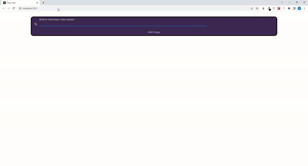
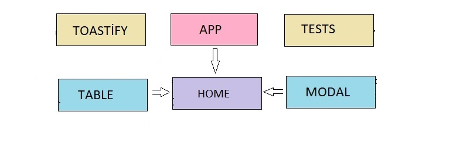

# PROJECT : My Case Study

## Table of contents

- [Screenshot](#screenshot)
- [Links](#links)
- [Libraries-Tools](#libraries-tools)
- [Project Skeleton ](#project-skeleton)
- [Project Structure](#project-structure)
- [Testing Content](#testing-content)
- [Author](#author)

## Screenshot

<p align="center">

</p>

## Links

- [Live Website](https://ozkankomu.github.io/ozkanKomu-Case-Study/)

## Libraries-Tools

- sass
- react testing library
- jest
- MUI
- MUI icons
- axios
- bootstrap
- json-server
- react-toastify

  CASE DESCRIPTION : In my case study, I used Mock Api as database. I pulled data from Api using Axios and Async-Await structure.

  I added an Add Cargo button to enter new cargo information under SerchInput. A modal opens when the Add Cargo button is pressed. In the module that opens, when the cargo information is entered and the Add Cargo button is pressed, the post process is performed with axios and new cargo information is added to the database.

  When any entry is made to Serach Input, the data is rendered to the table. If a space is entered, no filtering is performed. Search can be made by name or policy number. If an unavailable data is searched, the text "not found" is displayed.

  Tostify messages are issued after each successful or unsuccessful transaction. When the search is made, the matching data is printed on the screen. A delete button has been added for each cargo information. Here, when the delete button is pressed, a new post operation is made to the api. The data is deleted from the screen and from the database.

  I used bootstrap for responsive design. (I could do responsive design with "@media query". But I wanted to show BootStrap and MUI usage in different sections.)

  I used the React testinng Library library for testing. You can reach the live version of the codes from the links. You can perform the tests from the terminal with " yarn test --coverage " and get the coverage report. (While I was working on the Case, I had to take my daughter to the hospital due to a sudden illness. Due to the lack of time to complete the test, the Test coverage rate was a little low. If requested, I can write Test again with a more detailed and higher coverage rate. )

  If you want to download the project to your local and run it from your local. Follow the steps below.

  1. Download the repo to your computer by typing git clone " https://github.com/ozkankomu/ozkanKomu-Case-Study " commands from your computer terminal.

  2. Open the repo you downloaded with
     Visual Studio Code and run the "yarn " command from the terminal. (See that the packages have been successfully installed)

  3. Run the project by typing yarn start command in your terminal.

  Not: I didn't want to create .env file because sometimes Github cant read .env files so gives errors. This is the reason why I use direct Api URL and not use .env in my get and post operations.

## Project Skeleton

```
 My Case Study (folder)

|----public
     |----index.html
|----src
    |
    |----api
    |----components
         |----_tests_
                |----App.test.js
                |----Home.test.js
                |----Modal.test.js
                |----Table.test.js
         |----Modal.jsx
         |----Table.jsx

         |----pages
             |----Home.jsx

         |----SCSS
             |---- _reset.scss
		 |---- _variables.scss
	       |---- App.scss
		 |---- Home.scss
		 |---- Table.scss

         |----toastify
               |------Toastify.js
         |----Ap.js
         |----index.js
         |----setupTest.js
         |----gitignore
         |----package-lock.json
         |----package.json
         |----Readme
```

## Component Structure

<p align="center">

</p>

## Testing Content

- Testing infinite scrolling
- Testing API Requests and rendering afterwards
- Testing Components
- Testing Home page
- Testing dynamic data rendering in the same component
- Testing Button
- Testing Input

## Author

- Author - [OZKAN KOMU]
<p><i>All codes belong to me</i></p>
<center> &#8987; Happy Coding  &#9997; </center>
